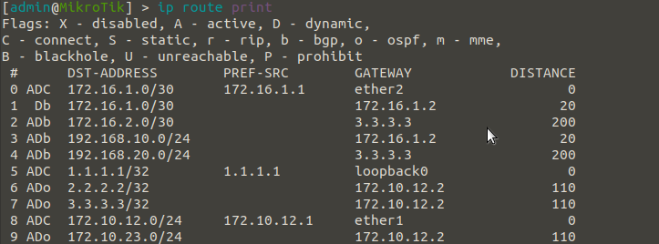

# MikroTik X Cisco: MPLS Layer-3

## MPLS (Multi-Protocol Label Switching) Layer-3 configuration with MikroTik router and Cisco router.

### MPLS Layer-3 network scheme


### Configure P (Cisco)
```
config t
! Create interface and set ip address loopback0
int lo0
ip address 2.2.2.2 255.255.255.255
no shutdown
exit

! Set ip address point-to-point PE-1
int fa0/0
ip address 172.10.12.2 255.255.255.0
no shutdown
exit

! Set ip address point-to-point PE-2
int fa0/1
ip address 172.10.23.2 255.255.255.0
no shutdown
exit

! Create ospf area 0 or backbone
router ospf 600
network 2.2.2.2 0.0.0.0 area 0
network 172.10.12.2 0.0.0.0 area 0
network 172.10.23.2 0.0.0.0 area 0
exit

! Create bgp backbone
router bgp 500
neighbor 1.1.1.1 remote-as 500
neighbor 1.1.1.1 update-source lo0
neighbor 3.3.3.3 remote-as 500
neighbor 3.3.3.3 update-source lo0
address-family vpnv4
neighbor 1.1.1.1 activate
neighbor 1.1.1.1 route-reflector-client
neighbor 3.3.3.3 activate
neighbor 3.3.3.3 route-reflector-client
exit
exit

! Configure mpls
mpls ip
mpls label protocol ldp
mpls ldp router-id lo0 force

! Set interface mpls
int fa0/0
mpls ip
exit

int fa0/1
mpls ip
exit

exit

```
### Verify Configurations P (Cisco)


### Configure PE-1 (MikroTik)
```
# Create interface and set ip address loopback0
/interface bridge add name=loopback0
/ip address add address=1.1.1.1 interface=loopback0 network=1.1.1.1
# Set ip address point-to-point P
/ip address add address=172.10.12.1/24 interface=ether1 network=172.10.12.0
# Create ospf area 0 or backbone
/routing ospf instance add name=600 router-id=1.1.1.1
/routing ospf area add instance=600 name=600
/routing ospf network add area=600 network=1.1.1.1/32 add area=600 network=172.10.12.0/24
# Create bgp backbone
/routing bgp instance add as=500 client-to-client-reflection=no name=bgp500 router-id=1.1.1.1
/routing bgp peer add address-families=ip,vpnv4 instance=bgp500 name=500 remote-address=2.2.2.2 remote-as=500 update-source=loopback0
# Configure mpls
/mpls ldp set enabled=yes lsr-id=1.1.1.1 transport-address=1.1.1.1
/mpls ldp interface add interface=ether1 transport-address=1.1.1.1
# Create ip vrf name CE
/ip route vrf add export-route-targets=500:100 import-route-targets=500:100 interfaces=ether2 route-distinguisher=500:100 routing-mark=CE
# Set ip address point-to-point CE-1
/ip address add address=172.16.1.1/30 interface=ether2 network=172.16.1.0
# Configure bgp CE-1
/routing bgp instance add as=500 client-to-client-reflection=no name=bgp700 router-id=172.16.1.1 routing-table=CE
/routing bgp instance vrf add instance=bgp500 redistribute-connected=yes redistribute-other-bgp=yes redistribute-static=yes routing-mark=CE
/routing bgp peer add as-override=yes instance=bgp700 name=700 remote-address=172.16.1.2 remote-as=700
```
### Verify Configurations PE-1 (MikroTik)



### Configure PE-2 (Cisco)
```
config t
! Create interface and set ip address loopback0
int lo0
ip address 3.3.3.3 255.255.255.255
no shutdown
exit

! Set ip address point-to-point P
int fa0/0
ip address 172.10.23.3 255.255.255.0
no shutdown
exit

! Create ospf area 0 or backbone
router ospf 600
network 3.3.3.3 0.0.0.0 area 0
network 172.10.23.3 0.0.0.0 area 0
exit

! Create bgp backbone
router bgp 500
neighbor 2.2.2.2 remote-as 500
neighbor 2.2.2.2 update-source lo0
address-family vpnv4
neighbor 2.2.2.2 activate
exit
exit

! Configure mpls
mpls ip
mpls label protocol ldp
mpls ldp router-id lo0 force

! Set interface mpls
int fa0/0
mpls ip
exit

! Create ip vrf name CE
ip vrf CE
rd 500:100
route-target export 500:100
route-target import 500:100
exit

! Configure vrf interface and point-to-point CE-2
int fa0/1
ip vrf forwarding CE
ip address 172.16.2.1 255.255.255.252
no shutdown
exit

! Configure bgp CE-2
router bgp 500
address-family ipv4 vrf CE
redistribute connected
neighbor 172.16.2.2 remote-as 700
neighbor 172.16.2.2 activate
neighbor 172.16.2.2 as-override
exit
exit

exit

```
### Verify Configurations PE-2 (Cisco)


### Configure CE-1 (Cisco)
```
config t
! Set ip address point-to-point PE-1
int fa0/0
ip address 172.16.1.2 255.255.255.252
no shutdown
exit

! Set ip address LAN
int fa0/1
ip address 192.168.10.1 255.255.255.0
no shutdown
exit

! Configure bgp PE-1
router bgp 700
neighbor 172.16.1.1 remote-as 500
address-family ipv4
redistribute connected
neighbor 172.16.1.1 activate
exit
exit

exit

```
### Verify Configurations CE-1 (Cisco)


### Configure CE-2 (Cisco)
```
config t
! Set ip address point-to-point PE-2
int fa0/0
ip address 172.16.2.2 255.255.255.252
no shutdown
exit

! Set ip address LAN
int fa0/1
ip address 192.168.20.1 255.255.255.0
no shutdown
exit

! Configure bgp PE-2
router bgp 700
neighbor 172.16.2.1 remote-as 500
address-family ipv4
redistribute connected
neighbor 172.16.2.1 activate
exit
exit

exit

```
### Verify Configurations CE-2 (Cisco)


** **

**NOTE:**<br>
Tools<br>
GNS3 version 2.2.15<br>
Cisco IOS C3725 (Dynamips)<br>
MikroTik RouterOS 6.47.7 (Qemu VM)<br>
Host<br>
Ubuntu Release 20.04.2 LTS (Focal Fossa) 64-bit Kernel Linux 5.4.0-1032-raspi aarch64 MATE 1.24.0<br>
Raspberry Pi 4 ARM 64-bit 4GB RAM
